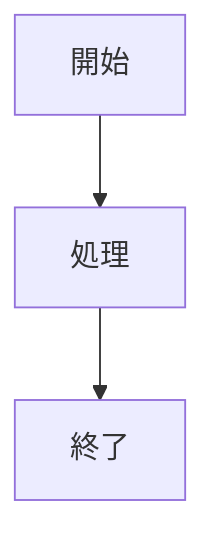

# Zenn 記事執筆ガイド - QWEN 向け

このドキュメントは、Zenn 記事投稿用リポジトリでの記事執筆に関する書式・ルール・ベストプラクティスをまとめたものです。

---

## 目次

1. [Zenn の概要](#zenn-の概要)
2. [執筆方法](#執筆方法)
3. [Markdown 基本記法](#markdown-基本記法)
4. [Zenn 独自記法](#zenn-独自記法)
5. [コンテンツ埋め込み](#コンテンツ埋め込み)
6. [記事・本・スクラップの違い](#記事本スクラップの違い)
7. [読まれる記事の書き方](#読まれる記事の書き方)
8. [制限事項](#制限事項)

---

## Zenn の概要

Zenn はエンジニア向けの技術情報共有プラットフォームです。

- **Articles**: 完結した技術記事
- **Books**: 複数章からなる書籍（有料販売可能）
- **Scraps**: スレッド形式のメモ・学習ログ

---

## 執筆方法

### 1. Web エディター（ブラウザ上）

Zenn にログインして使用します。

**主なショートカット**:
| ショートカット | 機能 |
|---|---|
| `Ctrl + P` | プレビュー表示 |
| `Ctrl + S` | 保存 |
| `Ctrl + I` | 埋め込みモーダル表示 |

### 2. ローカル環境 + Zenn CLI

GitHub リポジトリと連携してローカルで執筆できます。

```bash
# Zenn CLI のインストール
npm install -g zenn-cli

# ローカルプレビュー
zenn preview
```

**参考**:
- [Zenn CLI を導入する](https://zenn.dev/zenn/articles/install-zenn-cli)
- [Zenn と GitHub リポジトリを連携する](https://zenn.dev/zenn/articles/connect-to-github)

---

## Markdown 基本記法

### 見出し

```markdown
## 見出し 2（記事開始は h2 から）
### 見出し 3
#### 見出し 4
```

> **重要**: アクセシビリティの観点から**見出し 2（`##`）から始める**こと。

### テキスト装飾

```markdown
**太字**
*イタリック*
~~取り消し線~~
インラインで `code`
```

### リスト

```markdown
- 順序なしリスト
- ネストは半角スペース 2 つ
  - サブアイテム

1. 番号付きリスト
2. 続き
```

### テーブル

```markdown
| 名前 | 年齢 | 職業 |
|------|------|------|
| 田中 | 25 | エンジニア |
| 鈴木 | 30 | デザイナー |
```

**表内での改行**: `<br>` タグを使用

```markdown
| 項目 | 内容 |
|------|------|
| 注意 | 1 行目<br>2 行目 |
```

### リンク

```markdown
[アンカーテキスト](URL)
```

### 画像

```markdown

*キャプション*
```

**画像にリンク**:
```markdown
[](リンク URL)
```

### 引用

```markdown
> 引用文
> 
> > 二重引用
```

### 脚注

```markdown
脚注の例[^1]です。インライン^[脚注の内容]も可能。

[^1]: 脚注の内容その 1
```

### 区切り線

```markdown
---
```

---

## Zenn 独自記法

### メッセージボックス

重要な情報を強調表示します。

```markdown
:::message
通常のメッセージ
:::

:::message alert
警告メッセージ
:::
```

表示例:

:::message
通常のメッセージ
:::

:::message alert
警告メッセージ
:::

### アコーディオン（トグル）

長いコードや補足情報を折りたたみます。

```markdown
:::details クリックで展開
ここに折りたたみたい内容を書く。
:::
```

**ネスト構造**:
```markdown
::::details 外側
:::details 内側
ネストした内容
:::
::::
```

### コードブロック

**基本構文**:
````markdown
```言語名
コード内容
```
````

**ファイル名表示**:
````markdown
```javascript:example.js
const greeting = "Hello, Zenn!";
```
````

**DIFF ハイライト**:
````markdown
```diff javascript
- const old = "before";
+ const new = "after";
```
````

> **注意**: ファイル名に `:` を含めることは現在できません。

### 数式（KaTeX）

**ブロック数式**:
```markdown
$$
e^{i\theta} = \cos\theta + i\sin\theta
$$
```

> **注意**: `$$` の前後は空行が必要

**インライン数式**:
```markdown
$a\ne0$ というように $ で挟む
```

### ダイアグラム（Mermaid）



**制限事項**:
- 2000 文字以内/ブロック
- CHAIN 数 10 以下
- クリックイベントは無効化

---

## コンテンツ埋め込み

### リンクカード

```markdown
https://zenn.dev
```

または:
```markdown
@[card](https://zenn.dev)
```

### YouTube

```markdown
https://www.youtube.com/watch?v=VIDEO_ID
```

### X (Twitter)

```markdown
https://twitter.com/user/status/123456
```

リプライ元を非表示:
```markdown
https://twitter.com/user/status/123456?conversation=none
```

### GitHub ファイル

```markdown
https://github.com/owner/repo/blob/main/file.js#L10-L20
```

### その他埋め込み対応サービス

| サービス | 記法 |
|---------|------|
| GitHub Gist | `@[gist](Gist URL)` |
| CodePen | `@[codepen](ページ URL)` |
| SlideShare | `@[slideshare](スライド key)` |
| SpeakerDeck | `@[speakerdeck](スライド ID)` |
| CodeSandbox | `@[codesandbox](embed URL)` |
| Figma | `@[figma](ファイル/プロトタイプ URL)` |

---

## 記事・本・スクラップの違い

| 機能 | 記事 | 本 | スクラップ |
|------|------|-----|-----------|
| **用途** | 学んだことを体系的にまとめる | 体系的な知識を章立てで公開 | 気軽にメモ・学習ログ |
| **形式** | 完結した 1 つの記事 | 複数章からなる書籍 | スレッド形式で追記可能 |
| **投稿の気軽さ** | ややフォーマル | フォーマル | **カジュアル** |
| **ステータス** | 公開/下書き | 公開/下書き | **Open/Closed** |

### スクラップのベストプラクティス

- **学習ログ**: 勉強中の内容を気軽に記録
- **問題解決の記録**: エラーや課題の経過をスレッドで追跡
- **意見交換の場**: コメントを許可してディスカッション
- **本のフォーラム**: 公開した本への質問受付

---

## 読まれる記事の書き方

### 1. タイトルに具体的な技術スタックを含める

```
✅ 良い例:
- 「VS Code + Docker + Git で始める！シンプルな Java 開発入門 2025 年度版」
- 「Ubuntu 22.04 で KVM と VirtualBox を共存させる方法」

❌ 悪い例:
- 「開発環境について」
- 「仮想化ツールの話」
```

### 2. シリーズ化で継続的な関心を集める

- 複数回にわたる連載は読者の継続的なアクセスを生む
- 初回記事に被リンクが集まりやすく、シリーズ全体への流入が増える

### 3. 初学者向けの実践入門記事は需要が高い

- 開発環境構築の入門記事は多くのアクセスを集める
- 「始める」「入門」「構築方法」などのキーワードが効果的

### 4. 困りごと解決系の記事は検索流入が見込める

```
✅ 需要のあるテーマ:
- 「npm install -g 実行時にエラーが出るときの対処法」
- 「Raspberry Pi と USB シリアル変換アダプタでシリアル通信」
- 「mise, SDKMAN!, Starship の比較・導入記事」
```

### 5. 記事作成のフロー（TDD ライク）

```
1. この記事はなんなのか？を書く
2. 章立てを考える（Red）
3. 章立てをもとに内容をざっと書く（Green）
4. 校正する（Refactor）
```

**ポイント**:
- 一週間くらい寝かせてから校正すると効果的
- パンチライン（記事の面白いところ・価値の中心）を明確にする

---

## 制限事項

### Markdown 関連

| 項目 | 制限内容 |
|------|----------|
| **見出し 1（`#`）** | 使用不可（記事タイトルが h1 のため） |
| **HTML 複数行コメント** | 非対応（単一行のみ） |
| **テーブル内改行** | `<br>` タグを使用 |
| **インラインコードのスペース** | 先頭・末尾の半角スペースは削除される |

### URL 認識

- アンダースコア `_` を含む URL は認識されない場合あり
- 対処法: `@[card](URL)` 形式または `<URL>` で囲む

### ダイアグラム

| 制限 | 内容 |
|------|------|
| クリックイベント | 無効化 |
| 文字数 | 2000 文字/ブロック |
| CHAIN 数 | 10 以下 |

---

## 参考リンク

- [Zenn 公式 Markdown ガイド](https://zenn.dev/zenn/articles/markdown-guide)
- [Zenn エディタガイド](https://zenn.dev/zenn/articles/editor-guide)
- [Zenn スクラップの使い方](https://zenn.dev/zenn/articles/about-zenn-scraps)
- [Shiki 対応言語一覧](https://shiki.matsu.io/)
- [KaTeX 対応記法](https://katex.org/docs/supported.html)
- [mermaid.js 文法](https://mermaid.js.org/)

---

**最終更新**: 2026 年 2 月
